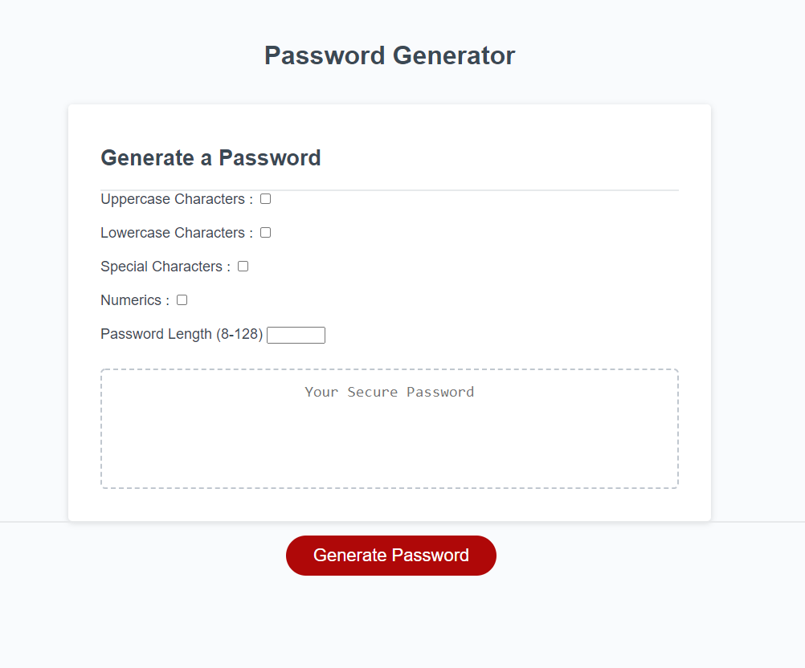
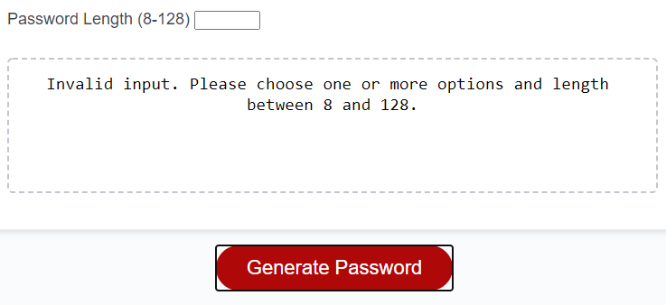
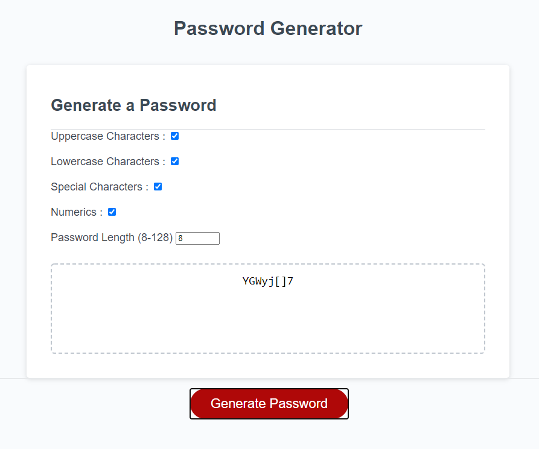

# Project: Password Generator

Simple page style with checkboxes indicating which characters to include in the generated password as seen below:

Input for a password length between 8 and 128 characters. Button function returns a message prompting user to input valid length and to check one or more boxes if they fail to do so.

On button click, the characters indicated by the check box will be randomized and show a password including one or more of the previously selectd characters. 

JavaScript file is commented thoroughly explaining the purpose of variables and functions. Chrome's developer tools show functionality when generating a password. Passwords generated that do not meet criteria specified with the checkboxes will return and generate passwords until one is created within the specified parameters.

Please click [here](https://zacharybinx.github.io/pw-generator/) to see for yourself!